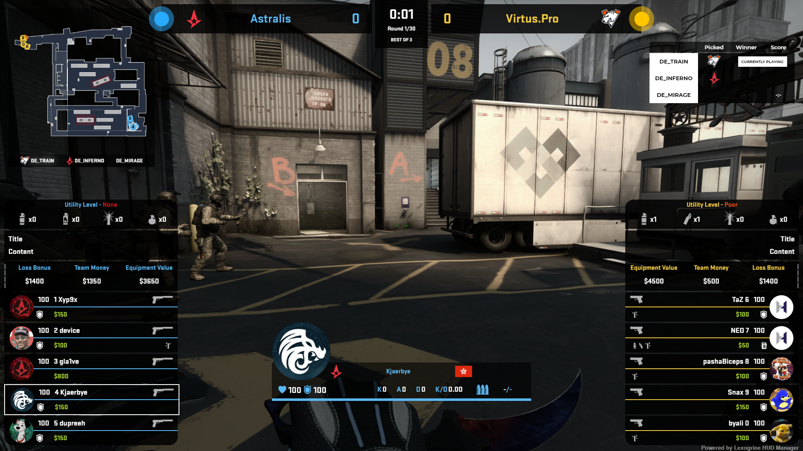

# Lexogrine HUD Manager

If you are in the business of broadcasting professional CS:GO matches, the Lexogrine HUD Manager is the tool just for you. It allows for a more effective management of data during tournaments; you can set up matches, vetos, team photographs, and then use it in any compatible HUD you have.

# Content

* [Features](#features)
* [Installation](#installation)
* [Example HUD](#example-hud)
* [Usage](#usage)
  * [Teams](#teams)
  * [Players](#players)
  * [Matches](#matches)
  * [HUDs](#huds)
* [Settings](#settings)
* [AFX Mode](#built-in-hud---afx-experimental-mode)
* [HUD API](#hud-api)
  * [Structure](#structure)
    * [hud.json](#hudjson)
    * [panel.json](#paneljson)
    * [keybinds.json](#keybindsjson)
  * [Radar](#radar)
    * [radar.css](#radarcss)
    * [Radar files](#radar-files)
  * [thumb.png](#thumbpng)
* [Technicalities](#technicalities)
  * [Build](#build)
  * [Sockets](#sockets)
* [REST API](#rest-api)
* [Credits](#credits)

## Features
- Player database
- Team database
- Match data collection
- Support for player avatars (custom and Steam)
- Killfeed API
- Boltobserv minimap support
- Tournament ladder
- Custom HUD support
- Keybinding API
  
## Installation
 Simply download the [Lexogrine HUD Manager's](https://github.com/lexogrine/hud-manager/releases/latest) installation file from its Github page and run it

## Example HUD 

To get our example HUD, go to [CSGO React HUD github page](https://github.com/lexogrine/csgo-react-hud), download it and add it in the Lexogrine HUD Manager!




## Usage

By default, Lexogrine HUD Manager runs on port 1349. During startup, if it detects that this port is being used by other process, it will use a randomly chosen port instead. After startup, you may want to check if the config files are loaded into CS:GO in the Settings tab (more info below).

When setting up the Lexogrine HUD Manager for an upcoming match, it is recommended to follow the points in following order: Teams -> Players -> Matches -> HUDs.

>Note - if you notice during live game that the teams are on the wrong side, just press Alt+R.

### Teams

This section is for additional data display in HUDs and the Lexogrine HUD Manager itself. It's an interface connected with a database that allows you to quickly edit any information about the team (name, logo, country flag).

### Players

This tab allows you to specify a player's displayed name, their country, real name and a picture as well. During matches players are identified by their SteamID64.

### Matches

In this section you can specify upcoming matchups you will spectate and choose which one is currently played. You have the option to set up teams taking part, their map scores and veto process.

Additionaly, while the match is live the current score is being saved in the background and once a map finishes, it's match score for the winning team increases. This way you don't have to worry, if match score is up-to-date. You can see the current map score in the veto view, and reset it if needed. Current map score is updated each time it detects end of the round from the CS:GO, unless the map has been marked as finished - in that case the score won't be updated, but still can be resetted, which will set the map back to a non-finished state.

>Note - a match has to be set as active and a used map has to be set up in veto in order for the Lexogrine HUD Manager to gather data.

### HUDS

This part is for choosing which HUD you want to use - there's a drag'n'drop area for HUD .zip files, so installation of new ones is a matter of seconds. Additionally you can use a local network address for Browser Source-type screen to grab the HUD view on another PC, access each of the HUD's action panels prepared by the authors, and directly run a transparent window with the HUD.


For convenience at the top of the screen you can push a command to run it in CS:GO (to hide the HUD, the radar, and/or the killfeed each HUD should indicate whether it supports the custom radar and killfeed or not). However, if you don't feel like running the commands on your own, the option to run CS:GO with all configs executed automatically will be enabled, when the Lexogrine HUD Manager detects CS:GO on your PC.


There is available an experimental mode to render HUD, which uses afx_interop. Using this method the HUD will be rendered directly in the CS:GO process, not as an overlay application. It will enable using custom HUDs in the fullscreen mode as well, not only fullscreen windowed.

>Note #1 - to use the killfeed you need to run CS:GO through HLAE. If you check the "Use custom killfeed" option you will have to specify the path to HLAE.exe in the Settings section.


>Note #2 - to use AFX (experimental) mode, beside specifying the path to the newest version of HLAE you are also required to set the path to the afx-cefhud-interop.exe file, which you will find in the [Release.7z and Release-Base.7z archive](https://drive.google.com/drive/folders/1CQFGMYhmz4x9DxunmwhWMp37ow6YOBON). You need to copy the .exe file from Release.7z to files from Release-Base.7z.

>Note #3 - it's impossible to set a custom loader/settings for HLAE, if you launch HLAE CS:GO through the Lexogrine HUD Manager, so in that case you still need to do it manually with HLAE. If you run CS:GO manually through HLAE and still want to use AFX mode, you need to add `-afxInteropLight` to launch options and once in the game execute `exec hud_interop` in the console.

### Live

Here you will find the list of players currently on the server. If you couldn't get their SteamIDs before the match, or the information you have in the database is incorrect, just click on a player you want to edit, and you will be redirected to the Players tab with the selected player already loaded in.

### Settings

Correct configuration is required to use the Lexogine HUD Manager - at least you need a free port. To use avatars loaded from Steam you also need to get your own Steam API key. You can additionally specify the GSI token to filter out payloads in case you are using more than one Gamestate Integration system.

Below the Steam API key, port and GSI token you can specify the path to HLAE.exe - it is required if you want to automate the CS:GO launch with killfeed enabled or AFX Mode.

Under the HLAE.exe settings there is an option to set a path to afx-cefhud-interop.exe file, which is required in order to use experimental mode - built-in HUD, instead of overlay. You can find out more in the "Built-in HUD - AFX experimental mode" section.

Moreover, you don't need to bother your head with copying the config files. You can see the status of both GSI and config files live and if they are missing, invalid, or otherwise broken you can just click one button and it's done - they are installed (provided that the Lexogrine HUD Manager has detected your CS:GO location). It's important to mention that when you change GSI port, you will need to restart the Lexogrine HUD Manager, so it will start listening on the new one.


In a situation when config installation doesn't succeed or the Lexogrine HUD Manager is unable to locate CS:GO, you can download the GSI config and an archive with all of the required cfg files using two buttons at the bottom of this section.

## Built-in HUD - AFX experimental mode

At this point there is an option to embedd any HUD in CS:GO using HLAE and afx_interop. It gives the advantage of being able to use CS:GO in fullscreen mode while using the custom HUDs. It must be noted however, that this mode may affect the framerate.

If you want to use this mode, you need to get HLAE, Release.7z and Release-Base.7z archive from here: https://drive.google.com/drive/folders/1CQFGMYhmz4x9DxunmwhWMp37ow6YOBON and set path to the afx-cefhud-interop.exe in the Lexogrine HUD Manager's settings. At this point the setup is completed - you just need to switch to the experimental mode in HUDs tab, toggle which HUD you intend to use and click RUN GAME (if you already have installed the config files of course).


## HUD API
### Structure
A HUD **must have** a valid `hud.json` to be considered legitimate. For optional functionalities, there are `panel.json` and `keybinds.json` files.
#### hud.json
  Lexogrine HUD Manager's upload field accepts HUD .zip files that contain a proper `hud.json` file. It should look like this:
  ```javascript
  {
	"name":"Example HUD", //Name of the HUD
	"version":"1.0.0", //Version
	"author":"osztenkurden", //Author(s)
	"legacy": false, //Specify whether it was created for the old system - it should work, but keep in mind that this functionality is deprecated
	"radar": true, //Does the HUD include radar support
	"killfeed": true, //Does the HUD include killfeed support
	"boltobserv": {
		"css":true, //Does the HUD have a custom.css radar file
		"maps":true //Does the HUD have custom radar backgrounds
	}
}
  ```
  The Lexogrine HUD Manager will not accept any .zip files that do not have a correct `hud.json` file in their root.
#### panel.json
`panel.json` controls the custom data inputs you want to have in the HUD, for example - tournament logo, tournament name etc., so any data that you want to set up on match to match basis. The example file looks like this:
  ```json
  [{
	"label": "Trivia",
	"name":"trivia",
	"inputs": [
		{
			"type": "text",
			"name": "title",
			"label": "Trivia title"
		},
		{
			"type": "text",
			"name": "content",
			"label": "Trivia content"
		},
		{
			"type": "action",
			"name": "triviaState",
			"values": [
				{
				"name": "show",
				"label": "Show trivia"
				},
				{
				"name": "hide",
				"label": "Hide trivia"
				}
			]
		}
	]
},
{
	"label": "Display settings",
	"name":"display_settings",
	"inputs": [
		{
			"type": "text",
			"name": "left_title",
			"label": "Left box's title"
		},
		{
			"type": "text",
			"name": "right_title",
			"label": "Right box's title"
		},
		{
			"type":"image",
			"name":"left_image",
			"label":"Left box's image logo"
		},
		{
			"type":"image",
			"name":"right_image",
			"label":"Right box's image logo"
		}
	]
}]
  ```
  And gives the result of:
  
  This file is basically an array of section objects. Each section object looks like this:
  ```javascript
{
	"label":"Displayed name of sections",
	"name":"id_name",
	"inputs": [] //Array of Inputs
}
```
And each input object looks like this:
  ```javascript
{
	"type":"text" | "image",
	"name":"id_name",
	"label": "Displayed name of the input"
}
```
Additionally, there is an action input that sends predetermined data and renders it as buttons - useful for toggling on-screen effects.
  ```javascript
{
	"type":"action",
	"name":"id_name",
	"values": [{
		"name":"id_name" //It is used as value for id_name action",
		"label":"Displayed name" //Label of the button
    }]
}
```
Each value in the action input is a seperate button. To see how to listen for data from the HUD's side, please see "`panel.json API`" part of the [CSGO React HUD](https://github.com/lexogrine/csgo-react-hud#paneljson-api) documentation.
#### keybinds.json
This file is basically another way to communicate with the HUD. Let's look at the example file:
```json
[
	{
		"bind":"Ctrl+B",
		"action":"toggleRadar"
	},
	{
		"bind":"Alt+B",
		"action":"radarBigger"
	},
	{
		"bind":"Alt+S",
		"action":"radarSmaller"
	},
	{
		"bind":"Alt+T",
		"action":"toggleTrivia"
	}
]
```
Again, ot is just an array of actions. Each bind only has `bind` and `action` properties. Bind is the keybind you want to use, and action is the identifier of an action. What differentiates it from the `panel.json` action input, is that here we don't have additional data packed with the action name.
#### Radar
A radar is hosted by the Lexogrine HUD Manager, so you don't have to include it yourself. You can access it at `/radar`. To load a HUD's custom radar.css you should add a `?hud=` query with the directory name of the HUD to the URL, unless you're working on the dev mode of the HUD - in this case you should add `?devCSS=true` if you have `custom.css`, and `devMaps=true` if you have custom radar backgrounds. If you are using the `csgo-react-hud` repo you don't have to think about those things, as it adds query params by itself.
#### radar.css
This file works as a `custom.css` file from `boltobserv` and loads itself into the radar for any given HUD. It requires for the `css` property in `hud.json` to be set to `true`.
#### Radar files
Radar background files have the same structure as in `boltobserv`. You should have a `maps` folder, and in it a directory for each map with the name of this map. Inside, place a `radar.png` with the background for the given map.
#### thumb.png	
You should include this file for a nice display in the HUDs tab in the Lexogrine HUD Manager, as it will be displayed next to its name. Recommended size: 64px x 64px.
## Technicalities

Lexogrine HUD Manager uses, among others, Express.js for its REST API and GSI endpoints, `csgogsi`, `csgogsi-socket` for data parsing, joining the additional info about teams and players and listening for events such as end of round.

Lexogrine HUD Manager exposes the port specified in settings as entry point for WebSockets, and sends `update` event that comes with CSGOParsed object, which definition you can find here: https://www.npmjs.com/package/csgogsi

In the background, Lexogrine HUD Manager also regularly checks if the port 3500 is taken, and if yes - it tries to see if a HUD in dev mode is running there. If it does, it will show it in the HUDs tab and allow to use it locally as any other HUD.

Local data is stored in a NeDB.js database locally at `%HOME%\hud_manager`. It includes config, teams, players and match data.

For looking up the Steam's and CS:GO's directory the `steam-game-path` package is used.

Lexogrine HUD Manager was written with Windows environment in mind. It probably works on Linux and Mac after compilation, however this isn't supported at the moment.

### Build

In case you want to compile the Lexogrine HUD Manager by yourself, you should clone the repo, run `npm install` and after that `npm run compile`. You might stumble into errors, that usually are fixed by the following commands:

```
npm rebuild
npm install registry-js
./node_modules/.bin/electron-rebuild
```
If the build has been successful, an `app` directory should appear with the installer and the unpacked version of the Lexogrine HUD Manager.

### Sockets
Once connected to the Lexogrine HUD Manager with sockets, it sends the following events:

|Name|Data|Description|
|--|--|--|
|`readyToRegister`||Manager then expects to get a `register` event with two arguments: `name: string` and `isDev: boolean`. `isDev` should only be true if you are in development mode AND on port 3500.
|`update`|CSGO GSI data
|`update_mirv`|MIRV `player_death` gameEvent
|`hud_config`|Data from `panel.json` filled form|
|`hud_action`|Action name and action type from `panel.json`
|`keybindAction`|Action name from `keybinds.json`
  

## REST API
|Endpoint| Method | Returned|
|--|--|--|
| `/api/teams` | GET | Array of teams
|`/api/players`| GET | Array of players
|`/api/players/:id`|GET|Find player by ID|
|`/api/players/avatar/:id`|GET|Find avatar of player by ID|
|`/api/players/avatar/steamid/:steamid`|GET|Find avatar of player with SteamID|
|`/api/teams/:id`|GET|Find team by ID|
|`/api/teams/logo/:id`|GET|Find team logo by ID|
|`/api/config`|GET|Get manager config|
|`/api/match`|GET|Array of matches|
|`/api/huds`|GET|Array of available HUDs|
|`/api/maps`|GET|Map pool array|
|`/api/gsi`|GET|Check if GSI file is loaded|
|`/api/cfg`|GET|Check if config files are loaded|
|`/api/game`|GET|Get latest data from CS:GO|

# Special credits
Big shout out to Loxar, for providing his set of a brand new weapon icons!

Also huge thanks to Wiethoofd, Komodo and TeDY for testing and massive amount of feedback and to boltgolt, for creating open-sourced custom radar <3
